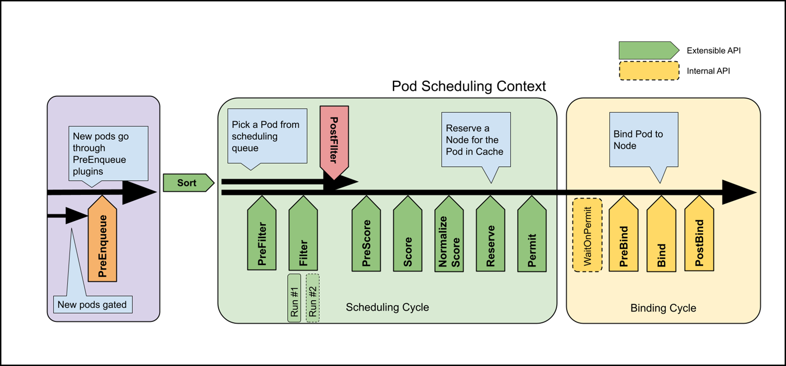
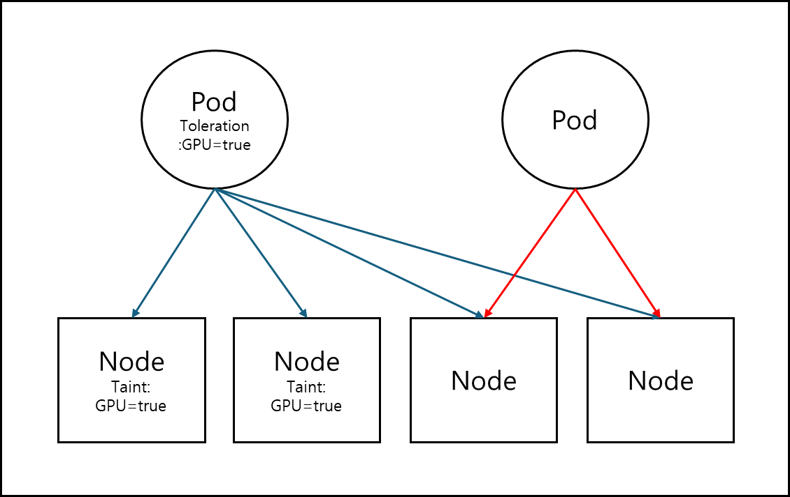

# 스케줄링
Kubernetes의 Pod에 대해서 저번에 알아봤다.
이러한 Pod는 실 서버로 이루어진 Node에 배치되게 되는데 이러한 배치도 마구잡이로 규칙없이 되는게 아니라
일정한 규칙을 가지고 있다.
어떤 규칙이 있는지 지금부터 알아보고자한다.

## Pod가 배치되는 절차
Pod의 배치를 관할하는 것은 kube-scheduler이다.   
kube-scheduler는 scheduling framework로 되어있는데 이는 직접 컴파일되는 플러그인 API 세트로 이루어져있으며
Pod의 처리는 플러그인 API들을 거치게 된다.

Kubernetes의 공식 사이트를 보게되면 Pod가 배치되는 절차에 대해서 다음과 같은 그림으로 나와있다.   
   

### 1. 필터링(Filtering)
- PreFilter : Pod의 정보 및 조건을 확인한다, unschedulable하면 중단한다.
- Filter : Pod에 적합한 Node를 골라낸다.
- PostFilter : Filter를 통과한 Node가 하나도 없을 때만 호출되며 기존 Pod를 삭제하여 Node를 확보하는
  Preemption을 호출한다.

### 2. 스코어링(Scoring)
- PreScore : 점수 계산 전처리 과정이다, 이 과정에서 taint와 toleration을 걸러낸다.
- Score : 여러 플러그인이 설정된 순서대로 동작하며 총합이 가장 높은 노드 순서대로 정리한다.
  여기서 스케줄링 알고리즘으로 통해서 score 값을 다르게 지정하게 할 수 있다.
  Normalize Score는 스코어 플러그인 안에 존재하는데 최종 순위를 계산하기 전에 0 ~ 100사이의 점수로
  조정한다. 이후 조정된 값과 순서를 조합해서 최종 노드를 선출해낸다.
- Reserve : 노드가 선정되었음을 스케줄러 캐시에 미리 알림으로 Race condition을 방지한다.
- Permit : 의도적으로 bind를 지연하고 대기하고 있는 상태이다.

### 3. 바인딩(Binding)
- waitOnePermit : 허가된 명령이 대기 중인 큐이다.
- PreBind : 필요한 리소스를 미리 확보한다 ex) volume, ram 등
- Bind : 실질적으로 Pod가 Node로 바인딩되는 과정이다.
- PostBind : 바인딩된 후 리소스 정리를 하는데 쓰ㄴ인다.

## Taint와 Toleration
필터링 과정에서 언급된 것으로 taint는 얼룩, toleration은 용인이라는 뜻으로
Node에는 taint가, Pod에는 toleration 값이 지정된다.
Pod가 Node에 배치될 때 Node들의 taint를 확인하게되는데 배치하고자하는 Pod의 toleration과 일치하지 않으면
대상 Node는 배치 후보에서 제외된다.   

# 참고 자료
- https://heumsi.github.io/blog/posts/setup-gpu-env-in-k8s/
- https://netpple.github.io/docs/deepdive-into-kubernetes/k8s-scheduler
- https://kubernetes.io/docs/concepts/scheduling-eviction/scheduling-framework/
- https://github.com/kubernetes/kubernetes/blob/a651804427dd9a15bb91e1c4fb7a79994e4817a2/pkg/scheduler/framework/runtime/framework.go
