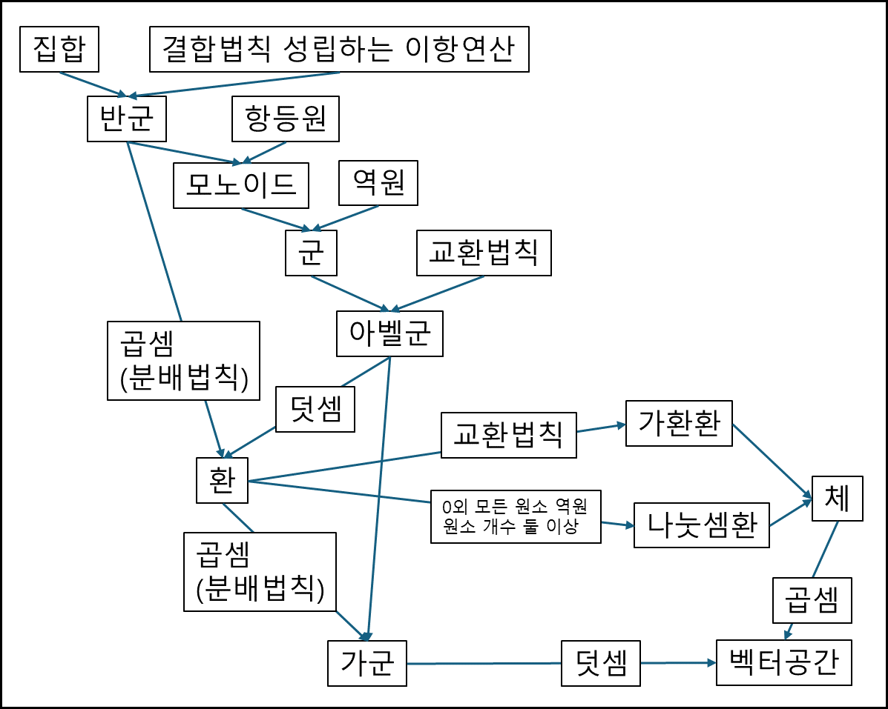

# 대수구조
대수 구조란 수 뿐 아니라 수를 대신 할 수 있는 것을
대상으로 하는 집합과 그 집합에 부여된 연산이 여러가지 공리로써 엮인 수학적 대상이다.
간단히 말하자면 일련의 연산들이 주어진 집합이다.

그냥 언뜻 들으면 전혀 와닿지 않는다.
하지만 만약 당신에 프로그래밍을 알고 있고, 추상화에 대해서 알고있다면 조금 더 쉽게 받아들일 수 있다.

어떤 객체 A가 있다고 해보자. 이 객체는 특정 Method M과 특정 속성 a를 가지고 있다.
어떤 객체 B는 A를 상속 받았다면 이 객체 역시 특정 메소드 M과 특정 속성 a를 가지게 될 것이다.

요컨대 대수구조 또한 마찬가지이다. 수나 수를 대신할 수 있는 것들과 가능한 연산(Method)가
특정한 형태(군, 환, 체등)라면 그 특정한 형태가 갖고 있는 연산이나 특성은 모두 갖고 있단 뜻이다.

아래는 선형 대수를 이해하기 위한 기초 대수 구조를 설명한 것이며
추가적으로 업데이트가 될 예정이다.

## 반군 (Semi-Group)
집합과 그 위의 결합법칙이 성립하는 하나의 이항 연산을 갖춘 대수구조를 반군이라 한다.
이 연산은 기본적으로 닫혀있어야한다. (집합 내에서 결과가 나와야한다)

## 모노이드 (Monoid)
집합과 그 위의 결합법칙이 성립하며 항등원을 갖는 하나의 이항 연산을 갖춘 대수구조이다.
즉, 항등원을 갖는 반군이다.

## 군 (Group)
집합과 그 위의 결합법칙이 성립하며 항등원과 역원을 갖는 하나의 이항 연산을 갖춘 대수구조이다.
즉, 역원을 갖는 모노이드이다.

## 아벨군(가환군) (Abelian Group, Commutative Group)
집합과 그 위의 결합법칙과 교환법칙이 성립하며 항등원과 역원을 갖는 하나의 이항 연산을 갖춘 대수구조이다.
즉, 교환법칙이 성립하는 군이다.

## 환(Ring)
집합과 그 위의 결합법칙과 교환법칙이 성립하며 항등원과 역원을 갖는 하나의 이항 연산을 갖추었으며
다른 하나의 연산은 결합법칙이 성립하며 전체는 분배법칙이 성립하는 대수구조이다.
즉, 덧셈에 대하여 아벨군, 곱셈에 대하여 반군을 이루며 전체가 분배법칙이 성립하는 대수구조이다.
(진짜 우리가 알고있는 덧셈이라기 보다는 표현하기 편해서 덧셈과 곱셈이라고 표현한다.
해당 부분에 대응되는 연산이면 상관없다)

## 가군 (Module)
집합과 그 위의 결합법칙과 교환법칙이 성립하며 항등원과 역원을 갖는 하나의 이항 연산을 갖춘 대수구조에
집합과 그 위의 결합법칙과 교환법칙이 성립하며 항등원과 역원을 갖는 하나의 이항 연산을 갖추었으며
다른 하나의 이상 연산은 결합법칙이 성립하며 전체는 분배법칙이 성립하는 대수구조에서 원소를 하나 갖고와 곱셈 연산을 부여한 대수구조이다.
이때 이 대수구조는 분배 법칙이 성립해야한다.
즉, 가군이란 어떤 환의 원소에 대한 곱셈이 주어지며, 분배법칙이 성립하는 아벨군이다.
가장 대표적인 가군은 벡터공간(정확하게는 체의 원소를 갖고 온다)이다.

## 가환환 (Commutative Ring)
집합과 그 위의 결합법칙과 교환법칙이 성립하며 항등원과 역원을 갖는 하나의 이항 연산을 갖추었으며
다른 하나의 연산은 결합법칙과 교환법칙이 성립하며 전체는 분배법칙이 성립하는 대수구조이다.
즉, 곱셈이 교환법칙을 만족하는 환이다.

## 나눗셈환 (Division Ring)
집합과 그 위의 결합법칙과 교환법칙이 성립하며 항등원과 역원을 갖는 하나의 이항 연산을 갖추었으며
다른 하나의 연산은 결합법칙이 성립하며 항등원을 가지며, 0이 아닌 원소는 역원을 가지되 대수구조 자체로는 원소가 둘 이상이며 분배법칙이 성립하는 대수구조이다.
즉, 0이 아닌 모든 원소가 역원을 가지며, 원소의 개수가 둘 이상인 환이다.

## 체 (Field)
집합과 그 위의 결합법칙과 교환법칙이 성립하며 항등원과 역원을 갖는 하나의 이항 연산을 갖추었으며
다른 하나의 연산은 결합법칙과 교환법칙이 성립하며 항등원을 가지며, 0이 아닌 원소는 역원을 가지되 대수구조 자체로는 원소가 둘 이상이며 분배법칙이 성립하는 대수구조이다.
즉, 가환환인 나눗셈환으로 사칙연산이 자유로이 시행 될 수 있고
산술의 잘 알려진 규칙들을 만족하는 대수구조이다.

# 대수구조 요약

# 참고 자료
- [이상엽Math- [선형대수학] 3강 수학적 벡터](https://www.youtube.com/watch?v=Q8NkThsTp_g)
