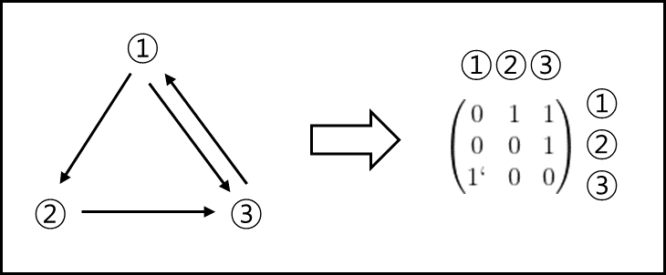
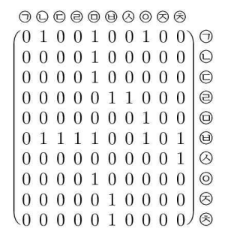
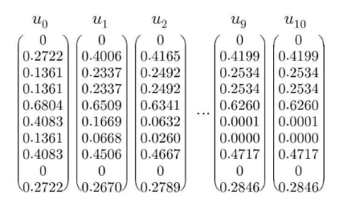

# 1. 우선순위 평가
## (1) 인접행렬
### ① 개념
요소간의 연결 관계를 나타내는 정사각행렬   
(수학적으로 엄밀한 정의는 아님)   
ex)   

### ② 권위벡터와 허브벡터
$n \times n$ 인접행렬 $A=(a_{ij})$에 대하여   
$$\begin{pmatrix}
\sum_{i=1}^{n}a_{i1} \\
\sum_{i=1}^{n}a_{i2} \\
\vdots  \\ \sum_{i=1}^{n}a_{in}
\end{pmatrix}$$와 $$\begin{pmatrix}
\sum_{j=1}^{n}a_{1j} \\
\sum_{j=1}^{n}a_{2j} \\
\vdots  \\ \sum_{j=1}^{n}a_{nj}
\end{pmatrix}$$을 각각 A의   
권위벡터와 허브벡터라 하며, 각 벡터의 성분을 권위 가중치와 허브 가중치라 한다.

## (2) 순위평가 원리
인접행렬 A와 초기권위벡터 $u_{0}$와 초기허브벡터 $v_{0}$에 대하여   
$$u_{k}=\left\{\begin{matrix}
u_{0}, k=0 \\ \frac{A^{T}v_{k}}{\left\| A^{T}v_{k} \right\|}, k>0
\end{matrix}\right.$$   
$$v_{k}=\left\{\begin{matrix}
v_{0}, k=0 \\ \frac{Au_{k-1}}{\left\| Au_{k-1} \right\|}, k>0
\end{matrix}\right.$$   
와 같이 새로운 정규화된 권위벡터 $u_{k}$와 허브벡터 $v_{k}$를 정의한다. (k는 정수)   
이때 $v_{k},u_{k}$를 연립하면 다음과 같이 정규화된 $u_{k}$와 $v_{k}$의 점화식을 얻을 수 있다.

$u_{k}=\frac{(A^{T}A)u_{k-1}}{\left\| (A^{T}A)u_{k-1} \right\|}$   
마찬가지로 $v_{k}=\frac{(AA^{T})v_{k-1}}{\left\| (AA^{T})v_{k-1} \right\|}$   

이 벡터들이 안정화가 되었다고 판단되는 상태로부터 각각 최종 중요도를 판별한다.

## (3) 사례
10개의 인터넷 페이지들(ㄱ~ㅊ) 간의 인접행렬 A가 다음과 같다고 하자.

(2)에서 소개된 절차에 따라 A의 정규화된 권위벡터가 안정화 될때까지   
반복계산한 결과는 다음과 같다.

따라서 $u_{10}$ 권위가중치로부터 페이지 ㄱ,ㅂ,ㅅ,ㅈ는 관련이 적고, 그외의   
페이지는 중요도가 높은 것부터 ㅁ > ㅇ > ㄴ> ㅊ > ㄷ = ㄹ 순서대로   
검색엔진에서 노출되어야함을 알 수 있다.

# 참고 자료
- [이상엽Math - 선형대수학 8강. 자료의처리](https://youtu.be/YJgyN91hwHw)
