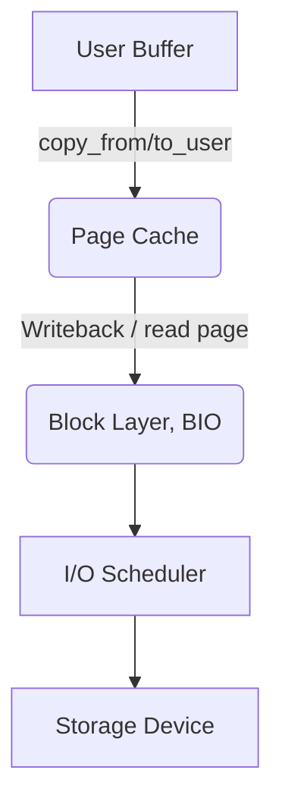
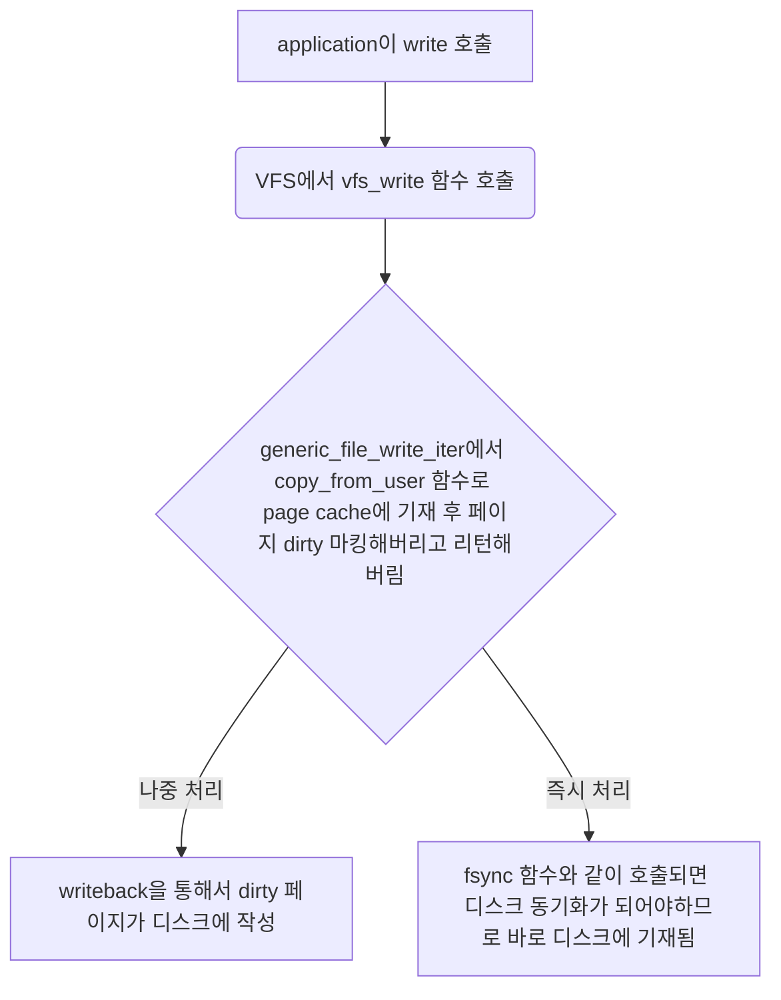
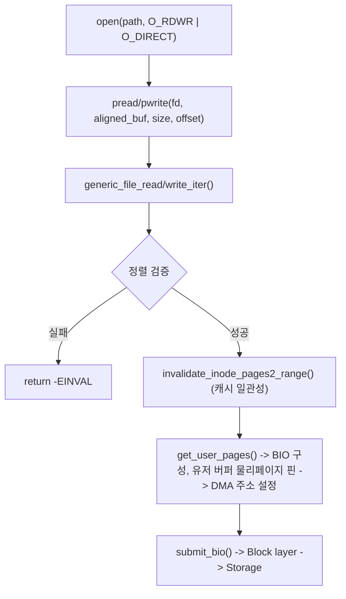

# 페이지 캐시와 파일 입출력
리눅스에서 파일을 읽거나 쓸 때 어떤 식으로 불러오고 쓰는지에 대한 포스팅이다.

## 1. 페이지 캐시(Page cache)
리눅스는 페이지 캐시라는 디스크 캐시가 구현되어있는데, 이 캐시는 디스크 접근이 필요한 데이터를 메모리에 캐싱시켜
DISK 접근을 줄이는 것이다. SSD를 사용하여 Disk 접근이 많이 빨라진 현 시대에도 DISK 접근은 지연시간을 늘리는 주범인데
이러한 디스크 캐시를 도입할 당시라면 더 말할 것도 없을 것이다.

기본적으로 페이지 캐시는 동적으로 변한다. 가용메모리에 따라 커지거나 작아진다. 이러한 특성 때문에
Linux에서 free memory를 보면 생각보다 적은 것을 알 수 있다. 이는 리눅스 커널에서 놀고 있는 메모리를 냅다 페이지 캐시로
사용하기 때문이다.

### 1) 캐시 축출 정책
이러한 페이지 캐시를 사용하는 부분에 대해서는 아래의 파일 입출력에서 계속해서 설명할 것이며, 지금 이야기 해 볼 것은
Page cache 대체 정책이다. 페이지 캐시 역시 무한정 늘어나지 않기 때문에 일정 크기가 된다면 특정 페이지를 제거하고
새로운 페이지를 넣어야한다. 이는 CPU 페이지 캐시와 비슷한 느낌으로 구동되는데, 구 버전에서는 이중 리스트 전략(Two-list strategy)
이라고 불리우는 개량형 LRU(Least Recently Used) 방식을 사용했다. 이 방식은 활성 리스트, 비활성 리스트 두 개의 리스트를 관리하고
활성 리스트는 최근 사용한 적이 있는 hot page이기 때문에 대체되지 않으나, 비활성 리스트에 있는 page는 cold page이기 때문에 대체 대상이 된다.    

최근 버전 역시 완전히 다르진 않다. Multi-Gen LRU(MGLRU)라는 방식의 개량형 LRU를 쓰는데, 기존의 이중 리스트 전략은
hot과 cold, 두 세대로만 나뉘지만 MGLRU는 좀 더 세대를 나누어 젊은 세대와 늙은 세대로 나뉘어 관리된다.
더 최근에 사용된 페이지는 젋은 세대로 분류되고, 오래 참조되지 않은 페이지는 더 오래된 세대로 밀려나 축출 후보가 된다.
이렇게만 보면 hot과 cold와 별로 다르지 않으나 좀 더 세밀하게 관리함으로써 다시 사용할 페이지가 축출되는 일이 적어지는 것이다.

### 2) 캐시 탐색
캐시가 있는지 없는지 탐색하는데 오히려 캐시를 사용하지 않는 시간보다 더 든다면 이러한 페이지 캐시를 쓰는 이유가 없어진다.   
때문에, 리눅스에서는 빠른 캐시를 탐색을 위한 자료구조를 가지고 있다.   
구 버전에서는 기수 트리(radix-tree)라고 하며, 이진 트리의 일종으로 파일 오프셋만 가지고 탐색할 수 있었다.
하지만 커널 4.2 버전부터 radix-tree는 XArray(eXtensible Arrays)로 변경되었다.

#### ※ XArray
큰 정수 인덱스와 포인터 값 매핑을 위한 커널 자료구조이며, 내부적으로는 희소 인덱스를 효율적으로 다루는 트리 계열 구조이다.
아래와 같이 생각하면 편하다.

```
xarray
  └─ xa_head
      └─ xa_node (상위 비트 담당)
          ├─ slots[0]
          ├─ slots[1]
          ├─ ...
          └─ slots[n]
               └─ 다음 xa_node 또는 실제 엔트리
```


## 2. 파일 입출력
기본적으로 linux에서는 파일 IO에 대해서 두 가지 모드를 지원한다.

### 1) Buffered I/O
기본 모드인 Buffered I/O는 커널의 Page cache를 활용하여 높은 처리량과 낮은 지연시간을 제공한다.   
Buffered I/O가 파일을 읽고 쓰는 절차를 간단하게 표현하면 아래와 같다.



위의 플로우 차트는 읽기와 쓰기 모두 뭉뚱 그려서 표현한 것인데, 읽기과 쓰기를 좀 더 세부적으로 다뤄보도록 하겠다.

#### a. read 
어떤 앱에서 파일을 읽는다고 하면 먼저 Page cache를 확인한다. 만약에 읽고자하는 파일이 Page cache에 있다면 데이터를 User 버퍼로 복사해오고
아니라면 해당 파일을 disk에서 찾아 읽어들여 Page cache에 추가 후 유저 버퍼로 옮긴다.



#### b. write
어떤 앱에서 파일을 쓴다고 하면 먼저 page cache에 page 단위로 복사하고 dirty 마킹을 한 뒤에 반환해버린다. 이후 실제로 디스크에 기록하는 것은
writeback을 담당하는 스레드가 비동기적으로 처리하는데 fsync()나 O_SYNC 플래그를 추가하여 호출하면 디스크에 바로 기재된다.

```mermaid
flowchart TD
    A[application이 read 호출] -->B(VFS에서 vfs_read 함수 호출)
    B --> C{generic_file_read_iter에서 Page cache 검색}
    C -->|Page cache hit| D[Page cache에서 가져옴]
    C -->|Page cache miss| E[readpage 함수로 디스크에서 읽어와서 Page cache에 추가]
    D --> F[copy_to_user 함수로 유저 버퍼로 복사]m
    E --> F
```

#### C. Page cache를 이용한 Buffered IO의 장단점
##### ⓐ 장점
- 캐시 히트시 매우 빠른 읽기
- 비동기로 write를 처리하기 때문에 느린 disk 작성을 기다리지 않아도 됨
- Readahead : 순차 읽기 패턴 감지시 미리 읽음
- 작은 쓰기를 모아서 한번에 디스크에 기록하기 때문에 Disk write 횟수 감소
- 통합된 캐시 형태이기 때문에 프로세스간에 캐시가 공유됨

##### ⓑ 단점
- writeback Thread가 디스크에 기재하기도 전에 전원이 꺼지거나 커널 패닉 발생시 작성한 데이터가 소실됨


#### d. MMAP
파일을 메모리에 맵핑할 수 있는 인터페이스이다. “주소로 직접 접근하는 대상”처럼 보이게 만드는 방식이라고 생각하면 된다.
아래와 같은 형태로 사용한다.

```c
#include <sys/mman.h>

void *mmap(void * addr, size_t length, int prot, int flags, int fd, off_t offset);
int munmap(void * addr, size_t length);
```

mmap 함수로 매핑한다. 각 인자의 명세는 아래와 같다.

- addr : 매핑되길 원하는 가상 주소인데 그냥 일반적으로는 NULL로 지정해서 함수가 알아서 지정하게 둔다.
- length : 매핑할 크기이다
- prot : 매핑된 메모리 접근 권한 OR 연산자로 붙여서 사용하며 명세는 아래와 같다.
  - PROT_READ : 읽기 가능
  - PROT_WRITE : 쓰기 가능
  - PROT_EXEC : 실행 가능
  - PROT_NONE : 사용할 수 없음
- flags : 매핑 방식과 옵션으로 아래와 같이 세부적으로 지정가능하다.
  - MAP_SHARED : 다른 프로세스와 매핑 영역을 공유함
  - MAP_PRIVATE : 다른 프로세스와 매핑 영역을 공유하지 않음
  - MAP_FIXED : 지정된 주소만 사용하게 강제함
- fd : 매핑할 파일이나 디바이스의 파일 디스크립터이다.
- offset : 파일 또는 디바이스에서 매핑을 시작할 위치이다.

mmap을 호출하면 커널로 부터 이 파일의 offset부터 length 바이트를 가상 주소 공간으로 연결하게 된다.   
만약 mmap이 실패하면 MAP_FAILED를 반환하게 된다.
접근 가능한 주소를 반환받으면 해당 주소를 통해 파일 데이터를 메모리처럼 읽고 쓸 수 있다.

munmap을 사용하면 메모리 매핑을 해제할 수 있는데, 이때 addr인자는 mmap에서 반환받은 값이고, length는 최초에 할당 요청했던 크기를 그대로
넣으면 된다.

### 2) Direct I/O
Direct I/O의 경우 Page cache를 우회하여 애플리케이션 메모리와 디스크 사이에 직접 DMA 전송을 수행한다.   
Page cache를 우회하기 때문에 write는 바로 DISK에 기재되나 DISK 내부 휘발성 메모리에 별도의 캐싱되어 영속하지는 않을 수 있다.
이 경우 O_DIRECT 플래그와 O_DSYNC 플래그를 같이 써서 디스크 캐시의 Flush를 따로 해줘야한다.
Direct I/O의 절차를 플로우차트로 그려보면 아래와 같다.



중간에 정렬 검증에 대한 부분이 있는데, 이는 DIRECT I/O를 사용하기 위해 지켜야할 조건으로 지키지 않으면 -EINVAL을 반환한다.
조건에 대한 부분은 아래와 같다.

- 버퍼 주소 : 512 바이트 정렬 - 일부 디바이스는 4KB
- I/O 크기 : 512 바이트 배수
- 파일 오프셋 : 512 바이트 배수

또한 DIRECT I/O는 동기적으로 처리할 수도있고, 비동기적으로 처리할 수 도 있다.

#### a. AIO + Direct I/O
POSIX AIO(libaio)와 Direct I/O를 조합하면 비동기 Direct I/O가 가능하다.
이를 통해 I/O 제출 후 즉시 반환받아 다른 작업을 수행하고, 나중에 완료를 확인할 수 있다.
이 조합은 데이터베이스(MySQL InnoDB, Oracle)에서 광범위하게 사용한다.

#### b. io_uring + Direct I/O
커널 5.1 버전 이상부터 제공된 비동기 I/O 프레임 워크이다. 링 버퍼를 쓴다고 io_uring 이라는 이름이 붙었으며 시스템 콜 없이 I/O를 요청하고 완료 체크가 가능하다.
시스템 콜이 없으니 어떤 상황에서도 매우 좋을 것 같으나, 실제로는 작은 데이터를 읽고 쓰거나 혹은 같은 파일에 엑세스할 경우 그냥 Buffered I/O가 빠른 경우가 많다.

##### ⓐ io_uring의 구조
일단 io_uring을 사용하기 위해서는 일단 2개를 알아야한다. SQ Ring과 CQ Ring이다.  
lock-free SPSC(Single-Producer Single-Consumer) 링 버퍼이다.
SQ와 CQ Ring은 mmap으로 사용자 공간에 매핑되어있는데, 이 공간은 user와 kernel 모두 확인이 가능하며
메모리 배리어(Memory Barrier)만으로 동기화하고 둘 모두 고정 크기로 캐시 친화적이다.

- SQ Ring   
간단히 말해서 I/O 요청을 담는 환형 큐이다. 안에는 SQE(Submission Queue Entry)가 들어있다. 

- CQ Ring   
간단히 말해서 완료 결과 담는 환형 큐이다. 안에는 CQE(Completion Queue Entry)가 들어있다.

##### ⓑ io_uring 사용 모드
###### - 기본 모드    
SQ Ring에 I/O 요청을 넣어놓고 ```io_uring_enter``` 함수를 호출하여 처리를 요청하는 모드이다.   
아래는 해당 코드 예시이다. 인자로 파일이름을 받아서 기본 모드로 읽은 뒤 출력하는 예시이다.

```c
// basic_mode.c
// build: cc -O2 -Wall -Wextra basic_mode.c -luring -o basic_mode
// run:   ./basic_mode ./testfile

#include <liburing.h>
#include <fcntl.h>
#include <unistd.h>
#include <stdio.h>
#include <stdlib.h>
#include <string.h>
#include <errno.h>

#define QD 8
#define BUF_SIZE 4096

static void die(const char *msg, int err) {
    if (err < 0) err = -err;
    fprintf(stderr, "%s: %s\n", msg, strerror(err));
    exit(1);
}

int main(int argc, char *argv[]) {
    struct io_uring ring;
    struct io_uring_sqe *sqe;
    struct io_uring_cqe *cqe;
    char *buf;
    int fd, ret;

    if (argc != 2) {
        fprintf(stderr, "usage: %s <file>\n", argv[0]);
        return 1;
    }

    fd = open(argv[1], O_RDONLY);
    if (fd < 0) die("open", errno);

    buf = malloc(BUF_SIZE);
    if (!buf) die("malloc", ENOMEM);

    ret = io_uring_queue_init(QD, &ring, 0);
    if (ret < 0) die("io_uring_queue_init", ret);

    sqe = io_uring_get_sqe(&ring);
    if (!sqe) die("io_uring_get_sqe", ENOSPC);

    io_uring_prep_read(sqe, fd, buf, BUF_SIZE, 0);
    sqe->user_data = 1;

    ret = io_uring_submit(&ring);
    if (ret < 0) die("io_uring_submit", ret);

    ret = io_uring_wait_cqe(&ring, &cqe);
    if (ret < 0) die("io_uring_wait_cqe", ret);

    if (cqe->res < 0) die("read completion", cqe->res);

    write(STDOUT_FILENO, buf, cqe->res);
    io_uring_cqe_seen(&ring, cqe);

    io_uring_queue_exit(&ring);
    free(buf);
    close(fd);
    return 0;
}
```

###### - 폴링 모드    
지속적으로 확인하는 폴링 모드 역시 요청쪽을 확인하느냐의 차이이다.   
- SQPOLL   
  커널에 머무는 폴링 Thread가 SQ Ring을 폴링으로 감시하여 제출 지연시간을 줄이는 방식이다.
  아래는 해당 코드 예시이다. 다른 예시와 마찬가지로 인자로 파일이름을 받아서 기본 모드로 읽은 뒤 출력하는 예시이다.

```c
// sqpoll_mode.c
// build: cc -O2 -Wall -Wextra sqpoll_mode.c -luring -o sqpoll_mode
// run:   ./sqpoll_mode ./testfile

#include <liburing.h>
#include <fcntl.h>
#include <unistd.h>
#include <stdio.h>
#include <stdlib.h>
#include <string.h>
#include <errno.h>

#define QD 8
#define BUF_SIZE 4096

static void die(const char *msg, int err) {
    if (err < 0) err = -err;
    fprintf(stderr, "%s: %s\n", msg, strerror(err));
    exit(1);
}

int main(int argc, char *argv[]) {
    struct io_uring ring;
    struct io_uring_params p;
    struct io_uring_sqe *sqe;
    struct io_uring_cqe *cqe;
    char *buf;
    int fd, ret;

    if (argc != 2) {
        fprintf(stderr, "usage: %s <file>\n", argv[0]);
        return 1;
    }

    memset(&p, 0, sizeof(p));
    p.flags = IORING_SETUP_SQPOLL;
    p.sq_thread_idle = 2000;  // ms

    fd = open(argv[1], O_RDONLY);
    if (fd < 0) die("open", errno);

    buf = malloc(BUF_SIZE);
    if (!buf) die("malloc", ENOMEM);

    ret = io_uring_queue_init_params(QD, &ring, &p);
    if (ret < 0) die("io_uring_queue_init_params", ret);

    sqe = io_uring_get_sqe(&ring);
    if (!sqe) die("io_uring_get_sqe", ENOSPC);

    io_uring_prep_read(sqe, fd, buf, BUF_SIZE, 0);
    sqe->user_data = 2;

    ret = io_uring_submit(&ring);
    if (ret < 0) die("io_uring_submit", ret);

    ret = io_uring_wait_cqe(&ring, &cqe);
    if (ret < 0) die("io_uring_wait_cqe", ret);

    if (cqe->res < 0) die("read completion", cqe->res);

    write(STDOUT_FILENO, buf, cqe->res);
    io_uring_cqe_seen(&ring, cqe);

    io_uring_queue_exit(&ring);
    free(buf);
    close(fd);
    return 0;
}
```  

- IPPOLL   
  커널이 블록 디바이스 완료를 인터럽트 대신 폴링으로 확인한다.
  O_DIRECT로 연 fd에서만 쓸 수 있고, 같은 ring 안에서 polled I/O와 non-polled I/O를 섞을 수 없다.
  아래는 해당 코드 예시이다. 다른 예시와 마찬가지로 인자로 파일이름을 받아서 기본 모드로 읽은 뒤 출력하는 예시이다.
  
```c
// iopoll_mode.c
// build: cc -O2 -Wall -Wextra iopoll_mode.c -luring -o iopoll_mode
// run:   ./iopoll_mode ./direct_file
//
// 주의:
// - 파일은 O_DIRECT로 열립니다.
// - 장치/파일시스템이 polling을 지원해야 합니다.
// - 예제는 4096 정렬을 가정합니다.

#include <liburing.h>
#include <fcntl.h>
#include <unistd.h>
#include <stdio.h>
#include <stdlib.h>
#include <string.h>
#include <errno.h>

#define QD 8
#define BUF_SIZE 4096
#define ALIGN    4096

static void die(const char *msg, int err) {
    if (err < 0) err = -err;
    fprintf(stderr, "%s: %s\n", msg, strerror(err));
    exit(1);
}

static int wait_cqe_iopoll(struct io_uring *ring, struct io_uring_cqe **cqe_ptr) {
    struct io_uring_cqe *cqe;
    int ret;

    for (;;) {
        ret = io_uring_peek_cqe(ring, &cqe);
        if (ret == 0) {
            *cqe_ptr = cqe;
            return 0;
        }

        ret = io_uring_enter(ring->ring_fd, 0, 1, IORING_ENTER_GETEVENTS, NULL);
        if (ret < 0) {
            if (errno == EINTR)
                continue;
            return -errno;
        }
    }
}

int main(int argc, char *argv[]) {
    struct io_uring ring;
    struct io_uring_params p;
    struct io_uring_sqe *sqe;
    struct io_uring_cqe *cqe;
    void *buf = NULL;
    int fd, ret;

    if (argc != 2) {
        fprintf(stderr, "usage: %s <file>\n", argv[0]);
        return 1;
    }

    memset(&p, 0, sizeof(p));
    p.flags = IORING_SETUP_IOPOLL;

    fd = open(argv[1], O_RDONLY | O_DIRECT);
    if (fd < 0) die("open(O_DIRECT)", errno);

    if (posix_memalign(&buf, ALIGN, BUF_SIZE))
        die("posix_memalign", errno);
    memset(buf, 0, BUF_SIZE);

    ret = io_uring_queue_init_params(QD, &ring, &p);
    if (ret < 0) die("io_uring_queue_init_params", ret);

    sqe = io_uring_get_sqe(&ring);
    if (!sqe) die("io_uring_get_sqe", ENOSPC);

    io_uring_prep_read(sqe, fd, buf, BUF_SIZE, 0);
    sqe->user_data = 3;

    ret = io_uring_submit(&ring);
    if (ret < 0) die("io_uring_submit", ret);

    ret = wait_cqe_iopoll(&ring, &cqe);
    if (ret < 0) die("wait_cqe_iopoll", ret);

    if (cqe->res < 0) die("read completion", cqe->res);

    write(STDOUT_FILENO, buf, cqe->res);
    io_uring_cqe_seen(&ring, cqe);

    io_uring_queue_exit(&ring);
    free(buf);
    close(fd);
    return 0;
}
```  
> 추가 업데이트 예정
{: .prompt-tip }

# 참고문헌
- 리눅스 커널 심층분석 (에이콘 임베디드 시스템프로그래밍 시리즈 33,  로버트 러브 저자(글) · 황정동 번역)
- [리눅스 커널 6.6.7 버전](https://www.kernel.org/pub/linux/kernel/v6.x/linux-6.6.7.tar.gz)
- [Different I/O Access Methods for Linux, What We Chose for ScyllaDB, and Why](https://www.scylladb.com/2017/10/05/io-access-methods-scylla/)
- [리눅스 커널 정리 /with MINZKN - Page Cache](https://www.minzkn.com/linuxkernel/pages/page-cache.html)
- [커널 연구회 - 커널 XArray 이해](https://kernel.bz/boardPost/118679/19)
- [Michael Kerrisk - man7.org - mmap(2) — Linux manual page](https://man7.org/linux/man-pages/man2/mmap.2.html)
