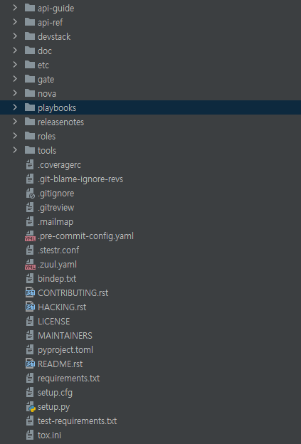

# Nova

> ※ 아직 해당 포스팅 작성이 완료되지 않았으므로 참고만 하기 바람
{: .prompt-tip }

## 1. 개요
OPENSTACK에서 진행하는 프로젝트 중 NOVA는 컴퓨터 인스턴스 (가상화 서버)를 제공하는 방법에 대한 프로젝트이다.
컴퓨터 인스턴스에 대한 제공만 관여하는 프로젝트이기 때문에 아래와 같은 다른 프로젝트와 연동해서 사용해야한다.

- Keystone : 인증
- Glance : 가상화 서버 이미지
- Neutron : 네트워크
- Placement : CPU 사용량이나 메모리 사용량 등 지표 제공

프로젝트 대부분이 Python 코드로 이루어져있으며 큰 구조는 아래와 같다.

   
출처 : https://docs.openstack.org/nova/latest/admin/architecture.html

왼쪽 위에 범례를 보면 잘 나와있지만 육각형은 NOVA를 제외한 서비스이고, 사각형은 NOVA 서비스이다.
각 서비스들이 통신을 하는 방식이 점선 혹은 실선으로 나와있다.

## 2. 각 컴포넌트별 설명

### 1) API 서버
이 서버를 통해 사용자는 하이퍼바이저, 스토리지, 네트워킹에 대한 명령과 제어를 프로그래밍
방식으로 사용할 수 있다.

API 엔드포인트는 Amazon, Rackspace 및 관련 모델에서 다양한 API 인터페이스를 사용하여 인증, 권한 부여 및 기본 명령 및 제어 기능을
처리하는 기본 HTTP 웹 서비스이며 이를 통해 다른 공급업체의 제품과 상호 작용하도록 만들어진 여러 기존 도구 세트와 API 호환성이 가능하다.
이러한 광범위한 호환성은 공급업체에 종속되는 것을 방지한다. 
기본적으로 HTTP 요청을 수신하고 명령을 변환하며 oslo.messaging 큐나 HTTP를 통해 다른 구성 요소와 통신하는 구성 요소이다.

### 2) Conductor
조정(빌드/크기 조정)이 필요한 요청을 처리하고, 데이터베이스 프록시 역할을 하거나 객체 변환을 처리한다.

### 3) Scheduler
각 인스턴스를 어느 호스트에 할당할지 결정한다.

### 4) Compute
하이버바이저 및 가상머신과의 통신을 관리한다.

### ※ oslo.messaging
메세징 라이브러리로 서버와 클라이언트간에 프로시저 호출을 하거나, 혹은 이벤트 알림을 발행하는데 사용되는 라이브러리이다.

## 3. 소스코드 구조
기본적으로 Openstack nova의 소스코드는 [이곳](https://releases.openstack.org/teams/nova.html)에서 받을 수 있다.
릴리즈 버전들을 올려둔 공식 사이트이다.
소스코드를 받아와보면 여러 폴더들이 있다.

실질적인 코드는 nova 폴더안에 있는 파일들이다.    
각 기능별로 구분되어있으며 전체를 다 살펴보기엔 시간이 많이 걸릴 것 같으니 주요한 부분만 살펴보겠다.

- api : Nova의 API 서버와 관련된 코드가 포함되어있으며 RESTful API 엔드포인트와 요청 처리 로직이 정의되어 있다.
- cmd : Nova의 주요 서비스를 실행하는 엔트리 포인트 스크립트가 포함되어 있다, ex) nova-compute, nova-conductor, nova-scheduler 등
- compute : 가상 머신의 생성, 삭제, 변경에 관련된 로직이 구현되어있으며, 사실상 가상화 관리의 핵심 기능을 포함하고 있다.
- conductor : DB와 NOVA 컴포넌트간의 중개 역할을 수행한다.
- db : 데이터베이스 스키마, ORM 모델등이 정의되어있다.
- scheduler : 컴퓨팅 리소스의 스케줄링 로직이 구현되어 있다.
- virt : 하이퍼바이저와 관련된 드라이버가 구현되어있으며 지원 코드 또한 포함되어있다.

# 참고문헌
- [오픈스택 - OpenStack Compute (nova)](https://docs.openstack.org/nova/latest/)
- [오픈스택 - Nova System Architecture](https://docs.openstack.org/nova/latest/admin/architecture.html)  
