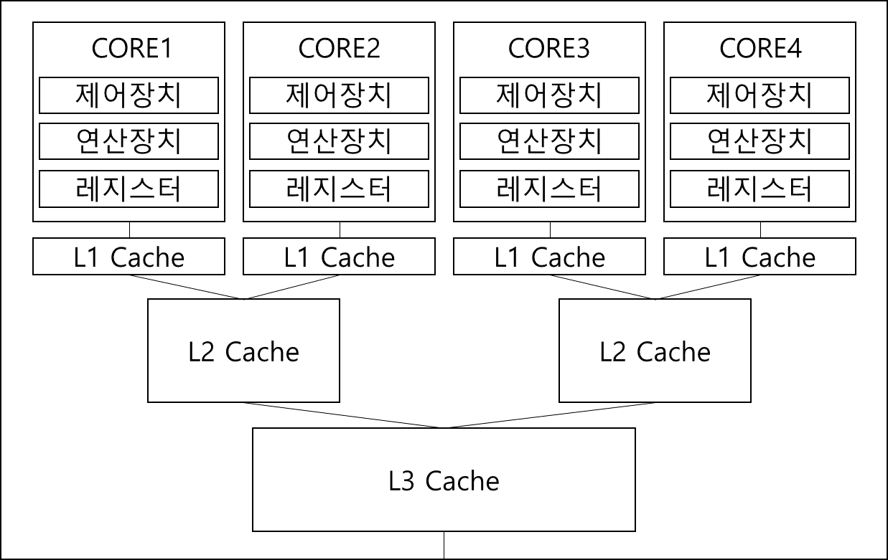

컴퓨터 OS를 이야기하기에 앞서서 주요 하드웨어에 대해서 알아볼까 한다.   
사실 컴퓨터의 하드웨어에 대해서 깊게 이야기하면 진짜 한도 끝도 없는게 이쪽이라 OS를 다루는 부분에서
필요한 부분을 중점적으로 다룰까 한다.

# CPU
일반적으로 머리 역할을 하는 칩이다. 레지스터와 연산장치, 제어장치 이렇게 세 개를 하나로 묶어서
하나의 코어로 멀티코어 CPU라고 하면 이러한 코어가 여러개인 것을 뜻한다.
이러한 코어마다 L1 캐시라고 코어가 개별적으로 사용가능한 캐시가 있고, 몇 개의 코어가 공유하는
L2 캐시가 있고, 코어들 전체가 공유하는 L3 캐시가 있다.
물론 이러한 캐시의 구조나 크기의 경우 CPU 모델에 따라 달라질 수 있다.

이런 코어는 하나의 스레드를 잡고 실행하게되는데, 하이퍼 스레딩이라는 기술로 한 개의 코어가
두 개의 스레드를 실행 할 수 있는 CPU도 있다. 이런 경우 OS에서는 CORE를 1개가 아닌 2개로 인식해서
구동한다고 한다.

컴퓨터를 부팅할 때 CPU 중에 코어 하나만을 사용하는데, 이때 사용하는 코어를 BSP(Boot Strap Processor)
그 외의 코어를 AP(Application Processor)라고 한다.
해당 코어들에는 인터럽트를 담당하는 부품이 따로 달려있는데 이러한 내용에 대해서는 차후 멀티코어에 대한 내용을 언급할때 추가적으로 다룰 예정이다.

또한 그림에서도 확인 할 수 있듯이 CPU에는 레지스터라는 것이 달려있는데
이 부분에 대한 설명은 "하드웨어에 대한 구조 5~6"에 걸쳐 설명을 해두었으니 그 부분은 확인 바란다.

# RAM (Random Access Memory)
사용자가 자유롭게 읽고 쓸 수 있는 메모리로 프로그램이 구동된다고 하면 이 메모리에 해당 프로그램의
데이터가 올라가 있는 것이다.   
OS와 지원하는 CPU나 메인보드에 따라 RAM의 최대 크기가 제한되기도하지만 기본적으로
이러한 RAM은 대부분 대대익선이다. 그리고 용량이 큰 것만 아니라 RAM에서 지원하는 클럭도 빨라야
실제 성능을 체감 할 수있다. RAM의 성능을 구하는 기준은 아래와 같다.
## 용량   
   모든 프로그램은 램에 데이터를 올려놓고 쓴다. 물론 메모리 용량의 제한으로 인해 메모리에 일부만 올려놓고 쓰는 기법으로
   (페이징) 운용하지만 메모리가 충분히 크다면 프로그램 전체를 다 올려놓고 쓸 수 있기 때문에 성능이 훨씬 빨라진다는건 당연한 이야기다.

## 대역폭 (Bandwidth)   
   한번에 옮길 수 있는 데이터의 양이다. 메모리 대역폭이 높다는건 한번에 옮길 수 있는 데이터가 많다는 것으로
   실상 메모리의 속도가 빠르다라고 이해해도 무방하다. 이러한 대역폭은 메모리에서 지원하는 클럭수에 비례하게 되는데
   가령 3200MHz 내부 동작 클럭을 가지고 있다고하면 한번 신호할때마다 8Bytes씩 전송하므로 
   대역폭은 25600MB/s가 나온다.

RAM은 0번지부터 용량 만큼의 물리적인 주소를 갖는데, 이 주소들의 특정부분은 이미 예약되어있어서 사용할 수 없는 부분이 있다.
OS가 사용하거나 혹은 메인보드가 사용하거나, 아니면 기기가 매핑되어있는 경우도 있는데 이 부분은 OS의 구조에 대해서 설명하기 시작하면서
추가적인 설명이 들어갈 예정이다.
