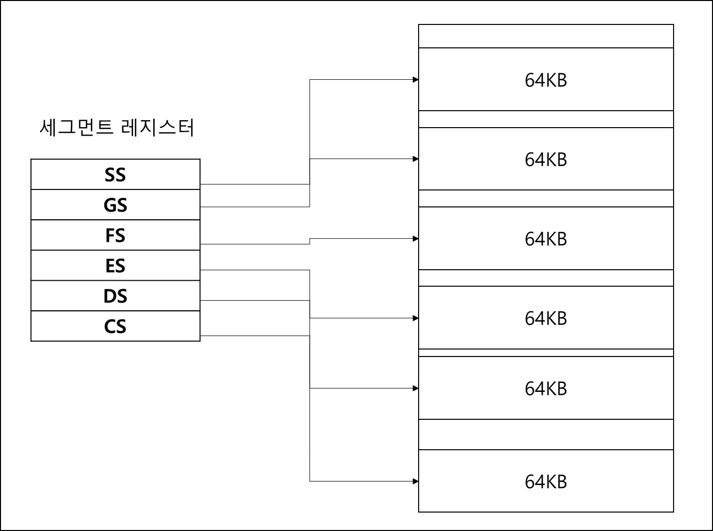
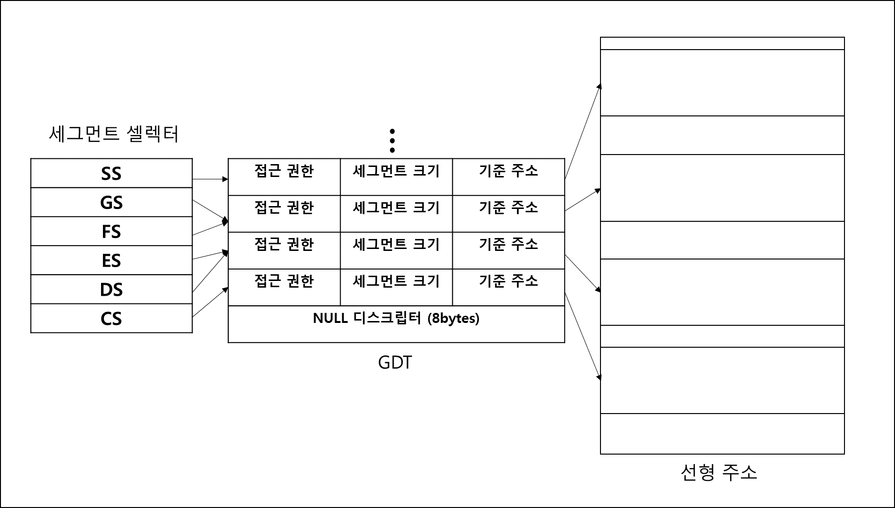
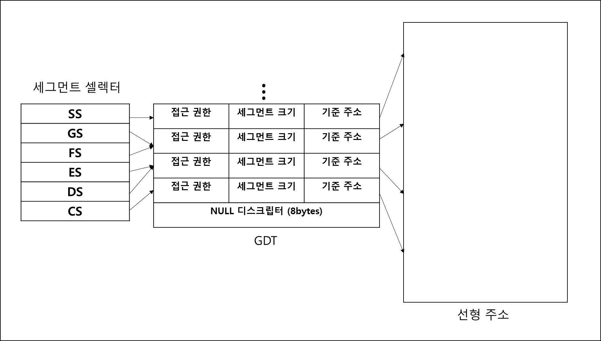

## 2. 세그멘테이션
세그멘테이션은 한마디로 세그먼트 레지스터를 이용하여 주소 공간을 관리하는 기법이다.   
이 세그먼트 레지스터는 프로세스를 실행하는데 필요한 데이터의 뭉치 시작 주소들을 가리키고 있는데
이러한 데이터 뭉치는 코드, 데이터, 스택으로 나눌 수 있다.

앞서 설명한 페이징이 고정된 사이즈로 메모리를 나눠서 관리하는 기법이라면 세그멘테이션은
고정된 사이즈가 아닌 각기 다른 사이즈의 데이터를 용도별로 나눠서 관리하는 기법이라고 생각하면된다.

세그멘테이션은 어떤 원리로 이루어질까?
모드에 따라 다른 방식으로 이루어지기 때문에 모드에 따른 세그멘테이션 방식을 알아보겠다.

### 1) 모드에 따른 세그멘테이션
#### 가. 리얼 모드
리얼 모드에서는 다음과 같은 구조로 세그멘테이션이 이루어진다.

     
 
리얼모드는 1MB의 제한이 있다고 했는데 세그먼트 레지스터와 범용 레지스터가 16bit인 리얼모드에서는 어떻게 1MB까지 접근이 가능한 것일까?
답은 바로 세그먼트 레지스터는 16을 곱한 값을 주소로 쓰는 것인데, 여기에 범용 레지스터값을 더해서
주소값으로 쓰기 때문에 1MB까지 접근이 가능한 것이다.
또한 이러한 세그먼트의 크기도 64KB로 고정이 되어있는데 이는 레지스터가 16bit이기 때문에 그렇다.

#### 나. 보호 모드
보호 모드에서는 다음과 같은 구조로 세그멘테이션이 이루어진다.
   

16bit mode에서는 세그먼트 레지스터인게 GDT를 선택할 때 쓰이는 세그먼트 셀렉터로 바뀐다.
세그먼트의 정보는 GDT에 8Bytes에 걸쳐서 기재되어있고 해당 GDT에는 기준주소를 위치로 세그먼트 크기만큼
세그먼트가 잡혀있다. 접근 권한에 따라 해당 GDT에 접근이 가능한지 불가능한지 체크된다.

#### 다. IA-32e 모드
IA-32e 모드에서는 다음과 같은 구조로 세그멘테이션이 이루어진다.
   

32bit 보호 모드와는 다른 점은 위의 그림을 보면 알겠지만 기준 주소와 세그먼트 크기를 무시하고 선형 주소 전체를 영역으로
세그먼트가 잡힌다.

## 참고 문헌
1. 64Bit 멀티코어 OS의 구조 - 한승훈 저
