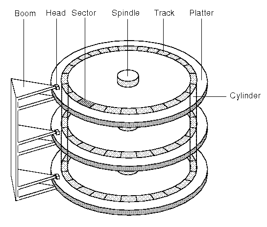

HDD는 Hard Disk Drive의 약자이고 SSD는 Solid State Drive의 약자이다.
최근에는 개인용 PC의 경우 SSD를 많이 쓰고, 좀 더 진보된 형태인 M.2도 많이 쓰지만
HDD 역시 삭제시 데이터 복구의 용이성이나 저렴한 가격으로 인해 별도의 수요가 있다.
때문에 둘 다 보조 기억장치로 쓰이며 각각의 구조는 아래와 같다.  

## HDD
하드 디스크 드라이버의 구조는 아래와 같다.   
   
출처 : https://www.datarecoverytools.co.uk/2009/12/22/chs-lba-addressing-and-their-conversion-algorithms/

하드디스크 드라이버는 자성을 띈 여러 개의 판을 평행하게 둔 형태로 생겼는데
이러한 판을 Platter라고 한다. 이 플래터은 여러개의 동심원으로 데이터를 기재하는데
이 동심원을 Track, 그리고 그 동심원을 512bytes 단위로 잘라둔 것을 Sector라고 한다.
그리고 다른 Platter지만 동일한 Track을 실린더라고 부른다.
데이터를 쓰거나 읽을 때 Platter를 회전시킨 뒤 긴 팔의 끝 부분으로 Platter의 데이터를 읽는데
이 긴 팔의 끝 부분을 Head라고 부른다. 이 Head는 각 플래터의 위 아래 둘다 달려있다.
그렇기 때문에 한 개의 Platter지만 위쪽면 아래쪽 면을 따로 읽거나 쓸 수 있다.

데이터를 쓰고 읽는 방식이 이런 방식이니 처음에 컴퓨터가 나오고 HDD가 도입 될때
원하는 위치의 데이터를 다루고자할때 CHS 방식을 사용하였다.

CHS 방식이란 Cylinder Head Sector의 약자로 어떤 Cylinder의
몇번 Head의 몇번 Sector를 읽거나 쓸지 지정하면 해당 위치로 작업하는 식이었다.
이 주소는 Sector, Head, Cylinder 순으로 올라가는데 이 말인 즉슨
마지막 Sector에 도달하면 그 다음 Head로 변경하여 첫번째 Sector를 읽고,
제일 아래 Head에 도달하면 그 다음 Cylinder로 변경하여 첫 번째 Head를 읽는 다는 뜻이다.

이렇게 CHS 방식으로 하면 문제가 무엇이냐면 하드 디스크 드라이버마다 Platter의 개수가 달라질 수 있는데
이러면 디스크 구성에 따라 다르게 코딩을 해야하는 문제가 있었기에 최근에는 상대적인 Sector의 위치를 말하는
LBA라는 방식을 통해 주소를 지정한다.

LBA 방식은 아까 CHS의 순서와 동일한데 Sector, Head, Cylinder 순으로 증가하며
각 Sector마다 0번부터 번호를 매기면 상대적인 Sector의 주소가 나온다.

HDD에 데이터를 기재할 때 강자성체가 코딩된 Platter에 Head를 갖다대서 자화 정렬방향을 바꾸는 식으로 기재하는데
이전 방향과 반대면 1, 이전방향과 같으면 0인 식으로 기재를 한다.
데이터를 읽어들일때는 자화의 정렬 방향을 읽어들여서 어떤 데이터인지 식별한다.

만약에 데이터를 지운다면? 정렬된 방향을 흐트리는 작업이 있을 것 같지만 사실은 그냥 이 데이터는
지워졌다고 표시해두고 내버려둔다. 차후에 다시 언급할 것이지만 OS에서 제공하는 파일 시스템에
HDD에 이 위치는 사용가능하다라고 표시해두고 HDD에는 데이터가 그대로 남아있단 소리다.
다른 데이터를 어떤 데이터가 지워진 그 위치에 기재한다고 하면 HDD에 남아있던 데이터에
덧씌워지는 것이다. 그렇기 때문에 HDD에서 실수로 데이터를 지운 경우 최대한 HDD를 사용하지 않고
바로 복구 툴로 HDD의 자화상태를 스캔해서 복구하면 복구 확률이 높아진다.

그렇다면 HDD에서 어떤 데이터가 지움 처리된 뒤 덮어쓰여졌으면 복구를 못하게 되는걸까?
그것도 아니다. HDD에서 지워진 데이터가 완전 식별 불가한 상태가 되려면 최소 7번은 덮어써야하며
최대 35회까지는 덮어써야한다고 한다.
몇몇 전문가의 경우 아예 디가우저로 자성자체를 날려버리거나 물리적으로 폐쇄해야 완전히 삭제된다고
주장하기도 한다.

이러한 HDD의 데이터 복구 용이성과 SSD에 비해 싼 가격으로 HDD는 오늘날에도 DB 서버의 스토리지로
종종 사용된다.
