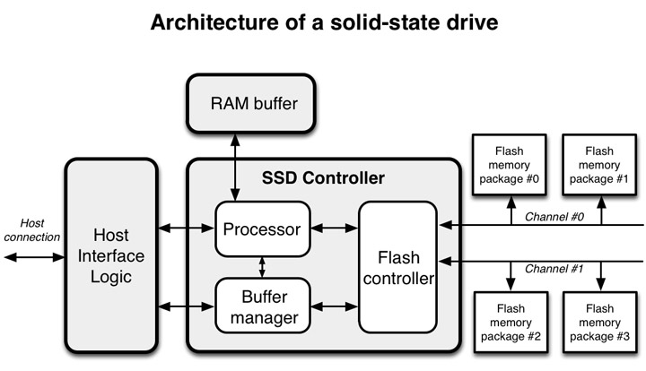

## SSD
기계적인 장치로 데이터를 읽고 쓰게 만들어진게 HDD라면 SSD는 전기적인 장치로
데이터를 읽고 쓰게 만들어졌다. SSD의 구조는 아래와 같다.    
   
출처 : https://codecapsule.com/wp-content/uploads/2014/02/ssd-architecture.jpg   

사용자의 요청이 Host Interface를 통해서 들어오게 되는데 지금 시점에서
가장 일반적인 형태는 SATA 혹은 PCle타입이다. 이러한 타입으로 연결되어 들어오는 데이터는
프로세서의 명령을 받아 플래시 컨트롤러로 이동되게 되어 각 플래시 메모리 패키지에 쓰여지거나
혹은 플래시 메모리 패키지에서 읽어온 데이터를 다시 반출하기도 한다.
이 과정에서 SSD에 자체적으로 달린 RAM은 캐싱 역할을 해서 데이터를 더욱 빨리 읽어오는 역할을 하거나
혹은 맵핑 정보를 저정하는데 쓰인다.

앞서 HDD에서 CHS 방식의 주소 지정 대신 LBA 방식으로 상대적인 섹터의 위치를 표기하는 방식으로
데이터의 위치를 표기한다고 했는데, SSD의 경우 HDD를 대체하기 위해서 나왔고, 그 때문에
SSD도 LBA 방식의 데이터 접근법을 지원한다.

그렇다고 SSD가 HDD처럼 여러개의 플래터(Platter)로 이루어져있다는 뜻은 아니다.
최근에 나온 대부분의 플래시 메모리는 NOR 방식이 아닌 NAND 방식의 플래시 메모리로
이루어져있는데 가장 작은 단위는 셀(Cell)이라고 하며 이 셀은 블록(Block)으로 묶여 있으며,
블록(Block)은 다시 플레인(Plane)으로 묶여 있다.

SSD에서 읽고 쓰기의 가장 작은 단위는 페이지(Page)이다.
쓰기와 읽기는 페이지 단위로 가능하지만 삭제는 블록(Block) 단위로만 삭제될 수 있다.
HDD는 삭제 처리가 되어도 그 위에 덮어 쓸수 있지만 SSD는 일일이 다 삭제처리를 해줘야한다.
하지만 매번 썼던 곳을 지웠다가 쓰려고하면 기다리는 시간이 늘어나기에 삭제 처리를 해두고 다른곳에 쓴다.
이후 SSD에서 따로 삭제 처리를 해주는데 이걸 TRIM 기능이라고 하며 OS에서 해당 부분을 삭제했다고
SSD에 신호를 보내는 식으로 OS단에서 지원해야하는 부분이기때문에
성능 향상을 생각하고 있다면 이 부분을 알고 있어야한다.

NAND 플래시 페이지 사이즈는 제품이나 제조사별로 다양하지만 대부분의 SSD는 2KB와 4KB 그리고
8KB와 16KB를 페이지 사이즈로 사용하고 있다.
또한 대부분의 SSD에서는 하나의 블록은 128개 또는 256개의 페이지를 가지므로,
블록의 사이즈는 256KB에서 4MB까지 다양한 사이즈를 가지게 된다.

SSD에서 LBA 방식을 지원한다고 했지만 이렇게 구조가 다른데 어떻게 LBA 방식을 지원해줄까? 그건 바로 중간에 논리 주소를 물리주소로 변환해주는게 있기 때문에
가능한 일인데 이것을 FTL (Flash Translation Layer)이라고 부른다. 논리적인 주소를 SSD의 물리적인 주소로 바꿔주는 것이다.

이러한 FTL의 내부는 STL(Sector Translation Layer), BML(Block Management Layer), LLD(Low Level Driver)로
나뉘며 STL은 SECTOR주소를 물리주소롤 바꿔주는 것, BML은 블록단위로 이루어진 플래시 메모리의 불량 관리를 담당한다.
또 LLD의 경우 실질적인 플래시 메모리를 사용하기 위한 드라이버라고 생각하면 된다.

### 참고 문헌

1. Coding for SSDs  
https://codecapsule.com/2014/02/12/coding-for-ssds-part-1-introduction-and-table-of-contents/

2. 개발자를 위한 SSD (Coding for SSD)   
   https://tech.kakao.com/2016/07/13/coding-for-ssd-part-1/
