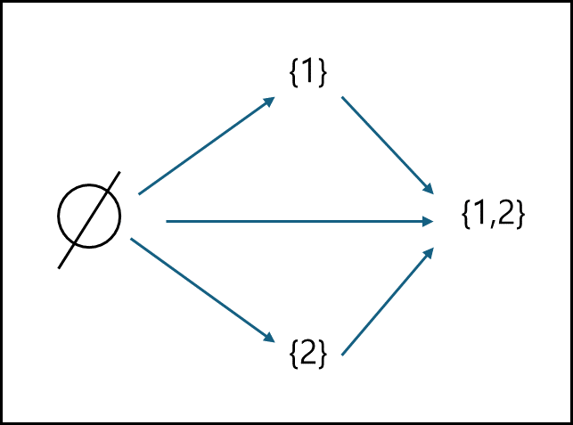
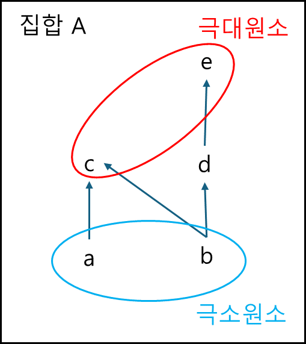
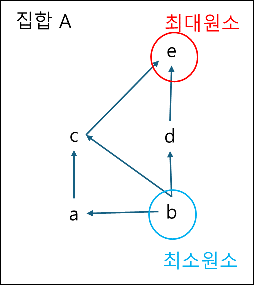
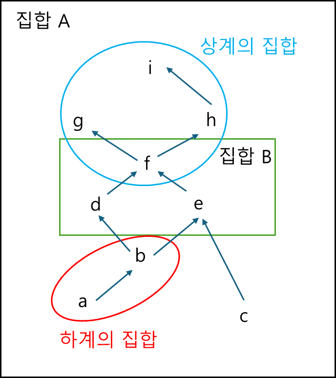

# 부분순서집합
## (1) 정의
### ① 부분순서관계 (Partial Order Relation)
반사적, 반대칭적, 추이적인 관계

ex 1) 두 집합 A,B에 대하여 $ A \subseteq B$   
반사적 : $A \subseteq A$   
반대칭적 : $A \subseteq B \wedge B \subseteq A => A = B$   
추이적 : $A \subseteq B \wedge B \subseteq C => A \subseteq C$

ex 2) 두 실수 x,y에 대하여 $ x \leq y $   
반사적 : x $\leq$ x   
반대칭적 : $x \leq y \wedge y \leq x => x = y$   
추이적 : $x \leq y \wedge y \leq z => x \leq z$   

ex 3) 두 자연수 n,m에 대하여 n이 m의 배수인 관계   
반사적 : 2는 2의 배수    
반대칭적 : a가 b의 배수이면서 b가 a의 배수면 a = b   
추이적 : 4는 2의 배수 $\wedge$ 8은 4의 배수 => 8은 2의 배수   

### ② 부분순서집합
집합 A 상에 부분순서관계 $\leq $가 주어진 경우 A를
부분순서집합이라하고, 이를 (A, $\leq $)로 나타내기도한다.   

※ 모든 원소들이 순서관계를 가져야하는 것은 아니다.   
ex) A = {$\varnothing$, {1},{2},{1,2} }   
(A, $leq$)      

이 경우 {1}과 {2} 사이에는 순서관계를 가지지 않는다.

### ③ 극대원소와 극소원소
A가 부분순서집합이라 할 때    
$\forall x \in A, x \geq a \Rightarrow x = a$   
를 만족하는 A의 원소 a를 극대원소,   
$\forall x \in A, x \leq b \Rightarrow x = b$   
를 만족하는 A의 원소 b를 극소원소라 한다.   
이러한 극대(극소)원소는 유일하지 않을 수 있다.

ex) A의 관계가 아래와 같을 때 극대(극소)원소   

ex) 멱집합 P(X)에서 $\varnothing , X$

### ④ 최대원소와 최소원소
A가 부분순서집합이라 할 때   
$\forall x \in A, x \leq a$   
를 만족하는 A의 원소 a를 최대원소,   
$\forall x \in A, x \geq b$   
를 만족하는 A의 원소 b를 최소원소라 한다.   
이러한 최대(최소)원소는 유일하거나 없다.

ex) A의 관계가 아래와 같을 때 최대(최소)원소   

## (2) 상한과 하한

### ① 상계와 하계
B가 부분순서집합 A의 부분집합이라 할 때   
$\forall  x \in B, x \leq  a$   
인 $a\in A$를 A에서 B의 상계,   
$\forall  x \in B, x \geq  b$   
인 $b\in A$를 A에서 B의 하계라 한다.   

ex) A와 B의 관계가 아래와 같을 때 상계와 하계   

### ② 상한과 하한
부분순서집합 A의 부분집합 B에 대하여 B의 상계(하계)들이   
집합이 최소(최대)원소를 가질때 이 원소를 A에서 B의 상한(하한)이라   
하고, sup B(inf B)로  나타낸다.   

ex) A = [0, 1) $\subset R$에서 0,1   

# 참고 자료
- [이상엽Math - 집합론 7강. 집합의 크기](https://www.youtube.com/watch?v=I_btU_4dQyU&list=PL127T2Zu76FveA8TGXZU-PSSt7GTMhKp6&index=9)
