# 리눅스 커널 컴파일
이번 포스팅에서는 리눅스 커널을 빌드하고 설치해보도록 하겠다.

## 진행환경
### 1. 하드웨어
- CPU : 11th Gen Intel(R) Core(TM) i7-1165G7 @ 2.80GHz 2.80 GHz
- MEMORY : 16GB

### 2. Host OS
Windows 10 Home

### 3. VM 환경
VM 환경 : VMware workstation 16 player
GUEST OS : UBUNTU 20.04
할당된 vCPU : 4
할당된 RAM : 8GB

## 절차
VM에 UBUNTU 공식 홈페이지에서 20.04의 ISO 파일을 다운 받아서 설치했다.   
내가 설치한 20.04의 커널 버전은 아래와 같이 확인했다.   
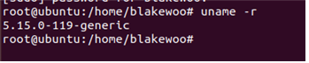   

현재 5.15.0-119버전이 설치되어있는데 이 버전을 5.4.214버전으로 업데이트 해보도록 하겠다.

먼저 Build 환경을 구성해야한다.   
리눅스 빌드를 위한 필수 의존성을 설치해야하는데 이 필수 의존성에 대해서 정의되어있는
url이 apt-sources.list에서 주석처리 되어있기 때문에 해당 주석을 풀어주어야한다.

실제 경로는 /etc/apt/sources.list이며 여기서 deb-src 부분을 주석 해제해주면 된다.   
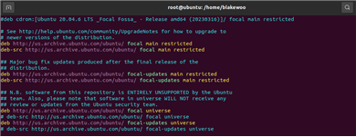   

이렇게 주석해제한 뒤에 apt-update 명령어로 apt에 반영해주도록 하자.
이후 아래의 명령어로 linux 커널 빌드에 필요한 의존성들을 설치해준다.

```shell
sudo apt build-dep linux # linux 필수 의존성 설치
sudo apt install libncurses-dev # 터미널 기반의 사용자 인터페이스를 개발 할 수 있도록 도와주는 라이브러리 설치
```

이후 별도로 커널 소스를 받기 위한 디렉터리를 하나 만들어주고 해당 디렉터리에서 wget으로 소스 코드를 받아준다.
나는 미러 페이지에서 5.4.214 버전을 tar로 압축된 버전을 받아 주었고 tar 명령어로 압축 해제해주었다.
```shell
wget https://mirrors.edge.kernel.org/pub/linux/kernel/v5.x/linux-5.4.214.tar.xz
tar -xf linux-5.4.214.tar.xz
```

압축이 해제되어 생성된 linux-5.4.214 디렉터리에 들어간 뒤에 .config 파일 설정을 위하여 아래의 명령어를 입력해준다.
```shell
make menuconfig
```

그러면 아래와 같은 GUI 환경이 나타난다.   
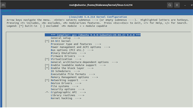

보이는 화면에서 General setup에 들어가면 Local version - append to kernel release 라고 되어있는
항목이 보이는데 여기서 내가 원하는 버전 명을 붙일 수 있다. 내가 작업한 커널을 표시하는데 유용하다.   
여기서 나는 blake-ver1.0이라는 버전 명을 추가하도록하겠다.

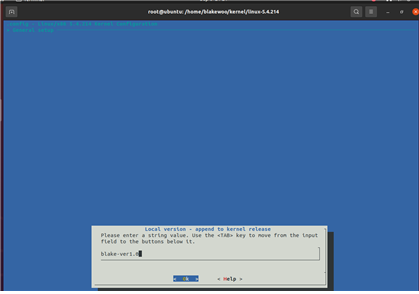

OK에 Enter를 쳐서 저장 후 ESC 입력 두번을 통해 첫 화면으로 나온다.
그 뒤에 Cryptographic API 메뉴로 들어가 가장 아래 Certificates for signature checking 메뉴로 들어가면
(debian/cononical-certs.pem) Additional X.509 keys for default system keyring 항목이 있는데
이 항목을 선택하면 나오는 debian/cononical-certs.pem 문구를 지워준다.   
이 문구는 해당 커널을 서명할 때 어떤 키를 사용할 것인지에 대한 내용이다. 그런데 이 키는 우리가 갖고있지 않기 때문에
지워줘야한다.

이후에 OK에 Enter를 입력하여 저장 한 후 우측 방향키를 옮겨 Save에 Enter 하여 저장한 뒤
esc 두 번을 GUI 화면을 벗어날때 까지 입력하여 설정화면에서 나온다.

이렇게 필요한 설정까지 했으니 해당 커널 소스코드를 빌드해야한다.   
이때 본인 PC의 CPU 코어 개수를 알아야한다.   
이는 빌드할때 다중 코어를 사용하면 좀 더 빌드 속도가 빨라지기 때문에 빌드시 설정 값에 넣어주어야한다.   

나는 VM에 4개의 코어를 할당했기 때문에 4개인 것을 알고 있지만 필요한 사용자를 위해 아래에 적어두었다.
```shell
grep -c processor /proc/cpuinfo 
```

이후 코어 개수를 옵션값으로 주고 아래와 같이 make를 해주면 된다.   
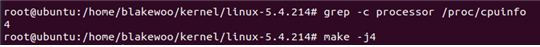   

커널 빌드를 처음해보면 놀랄 것이다.
왜 이렇게 시간이 많이 걸리는지.
실제로 나만 하더라도 약 40분 넘게 소요된 것 같다.
컴파일되는 파일들의 항목이 쭉 뜨고 난 뒤에 추가적으로 모듈들도 빌드해줘야한다.

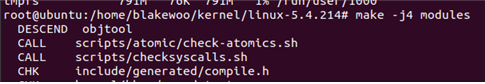

이렇게 빌드된 모듈들을 설치해준다.   
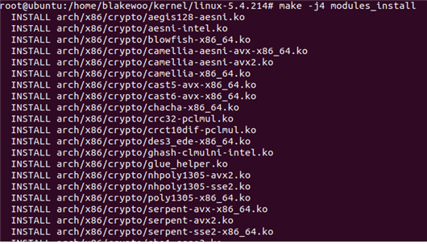

이후 빌드 된 커널 전체를 설치해주면 된다.   
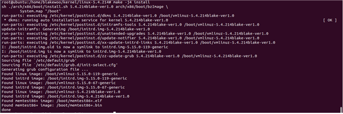

혹시 커널에 문제가 있을 때 이전 커널로 돌아가야하기 때문에 GRUB의 설정을 바꾸어
부팅시 커널을 선택할 수 있도록 바꾸도록하자.   
/etc/default/grub를 VIM 편집기로 열어 아래와 같이 바꿔준다.

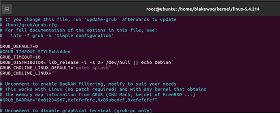

그냥 GRUB_TIMEOUT_STYLE=hidden을 주석처리했고, GRUB_TIMEOUT=0인걸
10으로 바꿔주었다
이후 wq로 저장하여 나온 다음에 grub-update를 이용하여 grub에 반영해준다.

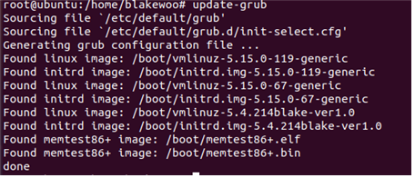

이렇게하고 재부팅하게되면 GRUB 부트 화면이 뜨게 된다.
거기서 내가 설치한 커널을 선택하여 부팅하면 된다.

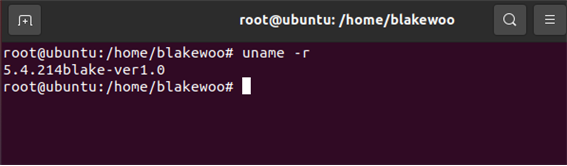

직접 빌드한 커널이 반영된 모습이다.
