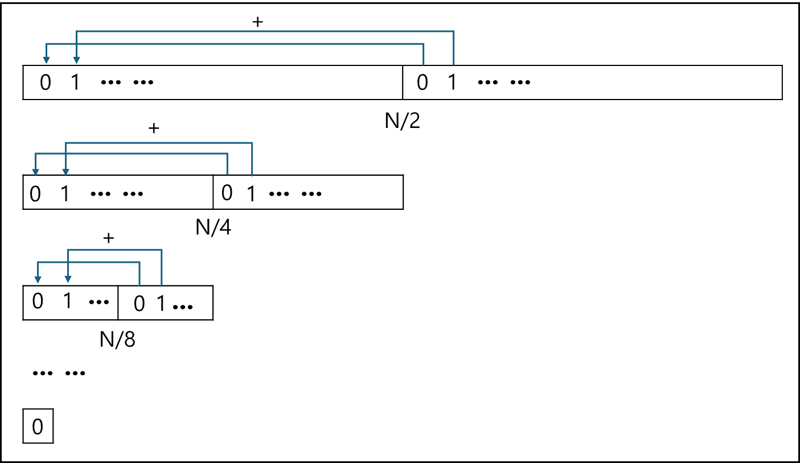
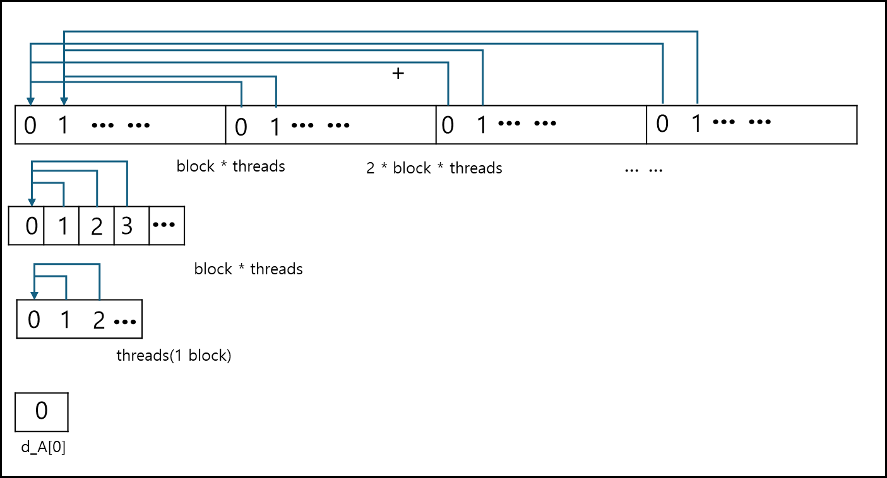

# CUDA Reduce 예제 분석
이번 시간에는 수업중에 나온 Reduce 함수에 대한 예제를 분석해보겠다.

## 1. reduce0 예제 분석
```cuda
// device 함수
__global__ void reduce0(float* x, int m) {
    int tid = blockDim.x * blockIdx.x + threadIdx.x;
    x[tid] += x[tid + m];  
}

// host에서 호출, N은 전체 데이터 셋 개수
for (int m = N / 2; m > 0; m /= 2) {
    int threads = (256 < m) ? 256 : m;
    int blocks = (m / 256 > 1) ? m / 256 : 1;
    reduce0 << < blocks, threads >> > (d_A, m);
}
```

reduce0 함수의 경우 절반씩 나눠가면서 전반부에 후반부 데이터를 더해간다.   
한번에 돌아가는 thread는 m값이 256 보다 크다면 256개, 그보다 작다면 더 작은 크기로 돌아가며,
기본적으로 N값이 2의 배수라는 가정을 두고 돌리는 것이다.



결과값은 d_A[0]에 남게 된다.

## 2. reduce1 예제 분석
```cuda
// device 함수
__global__ void reduce1(float* x, int N) {
    int tid = blockDim.x * blockIdx.x + threadIdx.x;
    float tsum = 0.0f;
    int stride = gridDim.x * blockDim.x;
    for (int k = tid; k < N; k += stride) 
        tsum += x[k];
    x[tid] = tsum;
}

// host에서 호출
reduce1 << < blocks, threads >> > (d_A, N);
reduce1 << < 1, threads >> > (d_A, blocks * threads);
reduce1 << < 1, 1 >> > (d_A, threads);
```

threads * blocks 개수가 전체 N개보다 작고 N개의 배수의 형태로 운용한다.



threads * blocks를 stride로 잡고, stride 기준으로 데이터를 갖고와서 첫번째 stride 범위안의 메모리에 값을 더한다.   
이후 두번째 커널에서는 threads * blocks 범위의 데이터를 한 개의 block안에 더한다.
이후 세번째 커널에는 한 개의 block에 있는 모든 값을 더해서 block의 제일 첫번째 Index에 넣는다.

위 함수에서 결과값은 d_A[0]에 저장된다.

## 2. reduce2 예제 분석
```cuda
// device 함수
__global__ void reduce2(float *y, float *x, int N) {
	extern __shared__ float tsum[]; // dynamic shared memory 
	int id = threadIdx.x;
	int tid = blockDim.x * blockIdx.x + threadIdx.x;
	int stride = gridDim.x * blockDim.x;

	tsum[id] = 0.0f;
	for (int k = tid; k < N; k += stride) tsum[id] += x[k];
	__syncthreads();

	for (int k = blockDim.x/2; k > 0; k /= 2){ // power of 2 reduction loop
		if (id < k) tsum[id] += tsum[id + k];
		__syncthreads();

	}
	if (id == 0) y[blockIdx.x] = tsum[0]; // store one value per block
}

// host에서 호출
int blocks  = 256;  // power of 2
int threads = 256;

reduce2 << < blocks, threads, threads * sizeof(float) >> > (d_B, d_A, N);
reduce2 << < 1, blocks, blocks * sizeof(float) >> > (d_A, d_B, blocks);
```

위 코드는 shared_memory를 사용한다.   
기본적으로 위 방식도 stride를 사용하되, stride 밖의 값은 shared_memory를 이용하여 값을 더하고   
stride 범위 안의 값은 2로 나눠가며 뒤의 값을 앞의 메모리에 더해가는 방식이다.     


shared_memory를 썼다는 점에서 reduce0와 reduce1 방식을 mix 했다고 볼 수 있다.   
위 함수 역시 d_A[0]에 결과값이 저장된다. 


## 3. reduce3 예제 분석
```cuda
// device 함수

// device only function smallest power of 2 >= n
__device__ int pow2ceil(int n) {
	int pow2 = 1 << (31 - __clz(n));
	if (n > pow2) pow2 = (pow2 << 1);
	return pow2;
}

__global__ void reduce3(float* y, float* x, int N) {
	extern __shared__ float tsum[];
	int id = threadIdx.x;
	int tid = blockDim.x * blockIdx.x + threadIdx.x;
	int stride = gridDim.x * blockDim.x;
	tsum[id] = 0.0f;
	for (int k = tid; k < N; k += stride) tsum[id] += x[k];
	__syncthreads();
	int block2 = pow2ceil(blockDim.x); // next higher power of 2
	for (int k = block2 / 2; k > 0; k >>= 1) {     // power of 2 reduction loop
		if (id < k && id + k < blockDim.x) tsum[id] += tsum[id + k];
		__syncthreads();
	}
	if (id == 0) y[blockIdx.x] = tsum[0]; // store one value per block
}

//host에서 호출
int blocks = 270;  // may not be a power of 2
int threads = 256;

reduce3 << < blocks, threads, threads * sizeof(float) >> > (d_B, d_A, N);
reduce3 << < 1, blocks, blocks * sizeof(float) >> > (d_A, d_B, blocks);
```

pow2ceil 함수는 N 값보다 바로 다음 큰 2의 승수 값을 반환하는 함수이다.
이 함수를 이용하여 reduce2와 동일하게 절반씩 나눠가면서 값을 더한다.   
하지만 여기서 다른 점은 block의 개수를 SM의 배수로 잡는 다는 점이다.
성능은 크게 차이가 없긴하다.

## 4. reduce4 예제 분석
#### 1) 코드
일단은 Reduce4 함수에 대한 코드이다.

```cuda
__global__ void reduce4(float* y, float* x, int N) {
  extern __shared__ float tsum[];
  int id = threadIdx.x;
  int tid = blockDim.x * blockIdx.x + threadIdx.x;
  int stride = gridDim.x * blockDim.x;
  tsum[id] = 0.0f;

  for (int k = tid; k < N; k += stride)
    tsum[id] += x[k];
  __syncthreads();
  
  // for 256 <= blockDim.x <= 512
  if (id < 256 && id + 256 < blockDim.x) tsum[id] += tsum[id + 256];  __syncthreads();
  if (id < 128) tsum[id] += tsum[id + 128];  __syncthreads();
  if (id < 64) tsum[id] += tsum[id + 64];  __syncthreads();
  if (id < 32) tsum[id] += tsum[id + 32];  __syncthreads();
  // warp 0 only from here
 
  if (id < 16) tsum[id] += tsum[id + 16];  __syncwarp();
  if (id < 8) tsum[id] += tsum[id + 8]; __syncwarp();
  if (id < 4) tsum[id] += tsum[id + 4]; __syncwarp();
  if (id < 2) tsum[id] += tsum[id + 2]; __syncwarp();
  if (id == 0)  
    y[blockIdx.x] = tsum[0] + tsum[1];
}
```

위 코드는 아래와 같은 형태로 main에서 호출된다.

``` c++
reduce4 <<< blocks, threads, threads * sizeof(float) >>> (d_B, d_A, N);
```

위 예제 코드를 분석 파트에서 하나씩 뜯어보겠다.

#### 2) 분석
먼저 main 함수에서 호출되는 형태를 보자.
``` c++
reduce4 <<< blocks, threads, threads * sizeof(float) >>> (d_B, d_A, N);
```
reduce4는 함수이름이고, <<< 다음에 순서대로 블록 개수, 스레드 개수, 스레드 개수 곱하기 float의 크기라고 생각하면된다.
그리고 끝에 d_B, d_A, N은 함수 선언간 정의된 인자들이다.

> 중간에 꺽쇠 세개 쌍으로 이루어진 것들은 원래 c++에 없는 문법이며 CUDA 컴파일러에서 처리해주는
문법이라고 생각하면 된다.
{: .prompt-tip }

함수 첫부분 __global__은 cpu가 GPU 함수인 커널을 호출할때 쓰는 지시자라고 생각하면 된다.
이후 인자로 float* y, float* x, int N은 함수 >>> 뒤에 들어간 인자에 Mapping 된다.

처음에 나오는 __shared__ float tsum[];
VRAM에 tsum 영역을 잡는데 필요한 양은 아까  threads * sizeof(float)로 받은 사이즈이다.

```cuda
  int id = threadIdx.x;
  int tid = blockDim.x * blockIdx.x + threadIdx.x;
  int stride = gridDim.x * blockDim.x;
  tsum[id] = 0.0f;
```

id는 해당 스레드가 스레드 블럭에서 몇번째인지를 나타내고, tid는 Grid에서 몇번째인지를 나타내며
stride는 해당 Grid가 몇 개의 스레드로 이루어져있는지 나타낸다.
그리고 tsum[id]는 스레드 블럭에서 id 번째의 합을 초기화 시킨다.

```cuda
for (int k = tid; k < N; k += stride)
    tsum[id] += x[k];
  __syncthreads();
```
stride 값만큼 더하며 tsum 배열에 id 번째에 값을 더해준다. 위 코드를 아래와 같이
나타낼 수 있다.


즉, 하나의 그리드와 동일한 사이즈로 매핑된 Full Dataset 일부에 나머지 값들을 모두 더하는 것이다.


그러고 나온 __syncthreads 함수는 ThreadBlock 내에서 모든 Thread를 동기화해주기 위해 쓰는 것이다.  
이게 없으면 전체가 다 더해지지 않은 상태에서 다음 코드로 넘어가버리기 때문에 이상한 값이 나온다.

```cuda
  // for 256 <= blockDim.x <= 512
  if (id < 256 && id + 256 < blockDim.x) tsum[id] += tsum[id + 256];  __syncthreads();
  if (id < 128) tsum[id] += tsum[id + 128];  __syncthreads();
  if (id < 64) tsum[id] += tsum[id + 64];  __syncthreads();
  if (id < 32) tsum[id] += tsum[id + 32];  __syncthreads();
  // warp 0 only from here
 
  if (id < 16) tsum[id] += tsum[id + 16];  __syncwarp();
  if (id < 8) tsum[id] += tsum[id + 8]; __syncwarp();
  if (id < 4) tsum[id] += tsum[id + 4]; __syncwarp();
  if (id < 2) tsum[id] += tsum[id + 2]; __syncwarp();
  if (id == 0)  
    y[blockIdx.x] = tsum[0] + tsum[1];
```

이후 코드의 경우에는 간단한데, 해당 Grid를 절반 단위로 잘라서 뒤 절반을 앞 절반 위치에 더해주는 형태이다.   
각 Thread가 잡고 계산하기 때문에 매우 속도가 따르지만, 이 역시 Sync를 맞추기 위해서 __syncthreads 함수는 잊으면 안된다.
절반 씩 나눠가면서 더하다가 32이하로 되는경우 __syncwarp 함수로 대체되는데 32 이하의 경우 한 개의 Warp로만 구동되기 때문에
 __syncthreads 함수보다 더 시간적 비용이 싼 __syncwarp 함수를 쓰는 것이다.


# 참고문헌
- 서강대학교 임인성 교수님 - 기초 GPU 프로그래밍 수업 자료
